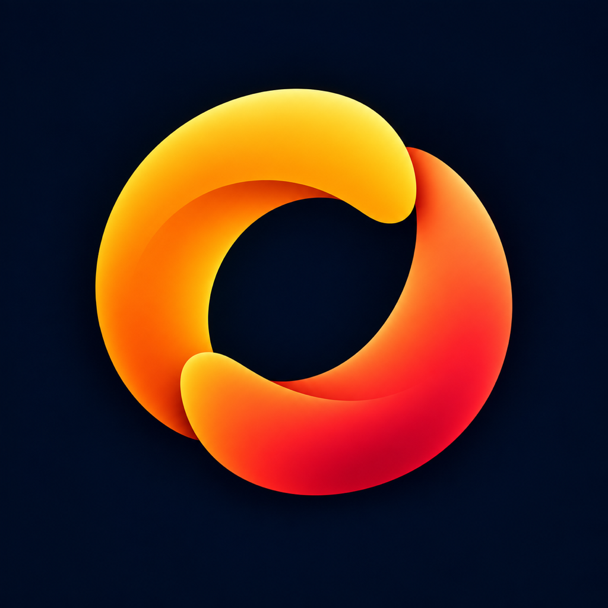

# Rock’n’Roll for iOS



Rock’n’Roll helps small music groups in Yerevan meet between rehearsals. Musicians open a shared jam link, join with microphone and camera off, then choose when to share sound or video. The native iPhone app keeps a real system call for background audio and uses CallKit to hold and resume around another phone call. It can also open compatible guest meeting invitations through a separate integration. There is no account or in-app room creation.

The public test jam is [rock.glowsoft.ru/jams/test](https://rock.glowsoft.ru/jams/test). The same page explains the group and lets a second participant join in a browser. The app also supports `conferenceguest://join?url=<percent-encoded HTTPS invitation>` from a web handoff. Only Rock links use the self-hosted room service; compatible guest invitations keep their existing endpoint-discovery flow.

The native jam engine uses LiveKit Swift, and the small Go service issues short-lived, room-scoped guest tokens for a single configured test room. The browser is an optional participant, not an embedded app view. Keys remain on the server. The server is isolated in two Podman containers behind a dedicated nginx virtual host; deployment inputs live in [RockServer](RockServer/).

The **Catch up** panel marks intervals that may have been missed during a held call, audio interruption or network loss. It can display only transcript lines actually supplied by a room provider. The test jam currently supplies none, so the panel does not claim to reconstruct missed speech. The local index is protected on the device, deleted on Leave, and expires after 24 hours. See [feature boundaries](docs/catch-up.md) and [privacy policy](https://rock.glowsoft.ru/privacy).

## Build and test

Requires Xcode with an iOS 18+ SDK, XcodeGen and Git LFS. The project pins both Swift SDKs. Required vendor symbols are confined to `RockNRoll/VendorIntegration` and package/resource references.

```sh
brew install xcodegen git-lfs
git lfs install
xcodegen generate
swift test --package-path ConferenceCore
open RockNRoll.xcodeproj
```

The app is signed with developer team `5V64BP2H3P`. `project.yml` generates the checked-in Xcode project. A build script copies resources required by the binary guest-integration SDK. SDK binaries are fetched through Swift Package Manager and are not committed.

`RockNRollUITests.testCommunityJamConnectsMuted` exercises the public test room on an attached iPhone. Other opt-in UI tests use live guest invitations supplied in `TEST_RUNNER_ROCKNROLL_TEST_INVITE`, never stored in the repository. For prior physical-device coverage and remaining release checks, see [validation](docs/validation-2026-09-23.md) and [App Store preparation](docs/app-store-preparation-plan.md).

## Media behavior

The app requests a genuine outgoing CallKit call for a user-requested jam and starts the selected media engine after the system activates audio. The microphone and camera start off. Routes can be selected through the in-call controls and iOS route picker. Another call holds the jam and restores the user’s media intent on return. iOS may interrupt sound while another telephone call owns audio; the app does not record it or claim to recover unheard speech. Background camera capture is not promised.
