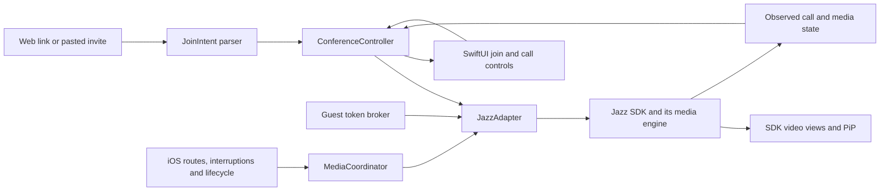

**Minimal SaluteJazz iOS client — implementation plan**

Prepared 23 September 2026. This is an implementation proposal supported by a live web inspection, the public iOS SDK interface, and Apple/Zoom documentation. It is not a claim that an iOS prototype has already passed these tests.

Build a Swift app around the official Jazz iOS SDK, initially retaining its video rendering and replacing only the surrounding UI and controls. Use a small backend to obtain SDK tokens without exposing an SDK secret or requiring the user to log in. Prove current-meeting interoperability and audio-session control before committing to the full implementation.

The minimum product should keep conference audio and membership alive while backgrounded, start every new join with the microphone and camera off, and recover from system media interruptions. Picture in Picture (PiP) is the preferred enhancement for visible background video. Continuous camera capture while hidden or locked and uninterrupted audio alongside every other app cannot be unconditional requirements on iOS.

**1. Findings and feasibility gates**

| Evidence checked | Finding | Consequence |
| --- | --- | --- |
| Live `https://salutejazz.ru/calls`, unauthenticated | Web version 26.62.3; Join is available separately from Login. The join page asks for name, meeting code and password. Choosing Later at the permission prompt exposes the form without granting camera/microphone access. | Implement a guest join screen. No account UI is necessary for meetings that allow guests. No live conference was joined during this research. |
| Official guest instructions | Organizers can disable guest access; a lobby may require admission. | A login-free client cannot join every meeting. Explain restricted access and waiting-room status. [Jazz guest joining](https://developers.sber.ru/help/jazz/guide/join-call) |
| Public iOS SDK repository | Inspected commit `6d5f92869690fa22bb489a9089aa554d733c6936`, dated 2025-08-01, commit message “update to version 25.3.1020”. | Obtain the current supported SDK and confirm compatibility with the current cloud backend. Pin the accepted version and binary checksums. [Pinned repository](https://github.com/salute-developers/jazz-ios-sdk/tree/6d5f92869690fa22bb489a9089aa554d733c6936) |
| SDK deployment requirements | Documentation says iOS 13+, README says 14+, but the inspected Package.swift and device module target iOS 15. | Trust the delivered package when building. Proposed product baseline: iOS 18+, subject to device coverage needs; this is a product choice, not Jazz's documented minimum. [Package.swift](https://github.com/salute-developers/jazz-ios-sdk/blob/6d5f92869690fa22bb489a9089aa554d733c6936/Package.swift), [SDK overview](https://developers.sber.ru/docs/ru/jazz/sdk/ios/overview) |
| Authentication surface | The inspected SDK accepts secret-key, Jazz-token and JWT providers; no unauthenticated initialization case appears in that public enum. | “No login” means anonymous user experience, not necessarily no technical credentials or backend. Confirm licensing and guest identity support with Jazz. [Authorization guidance](https://developers.sber.ru/docs/ru/jazz/sdk/authorization-patterns) |
| Media/system controls | Public types include custom overlays, route selection, CallKit/PiP flags and conference events. | Reuse SDK capabilities. Presence of a flag does not establish that the feature works on the current OS or with a custom overlay. |
| Audio policy hook | No explicit audio-category/mixing configuration hook was found in the top-level JazzSDK interface inspected. Bundled WebRTC exposes lower-level audio-session APIs. | Vendor-supported ownership of those APIs is the main integration uncertainty. Do not assume a bundled WebRTC symbol can safely override Jazz's internal policy. |

The public SDK is a distribution of binary frameworks and interface files, not a complete source implementation. Its bundled WebRTC/Jitsi-related headers are not sufficient to implement a compatible standalone client. A generic WebRTC or Zoom SDK cannot join a Jazz conference by URL alone: the service's signaling, authentication and conference behavior still have to be implemented.

**Gate A — joining actual target meetings.** On a physical iPhone, use a current supported Jazz SDK to join an existing cloud conference created outside the SDK application's own context, using a guest display name and an invite. Test password, lobby and guest-disabled variants. Establish whether the SDK credentials permit this use across organizer organizations. If not, the requested scope needs a vendor solution before development proceeds.

**Gate B — safe initial media state.** Join through every supported entry path with `.allOff`; verify from a second participant that no local camera frames or audible microphone content arrive before an explicit user action. Receiving other participants must still work. Check whether microphone permission/capture is required even when sending is muted, and record that distinction.

**Gate C — media coexistence.** Test the SDK with its supported CallKit integration enabled and disabled. Verify background audio, another app starting playback, Bluetooth route changes and recovery from interruptions. Establish a supported way to retain the intended audio policy through join, camera enable, route change and reconnect. A one-time `AVAudioSession.setCategory` call is not adequate evidence.

**Gate D — web handoff.** Select an owned HTTPS domain for Universal Links. Direct association with `salutejazz.ru` requires cooperation from its owner. Link parsing inside JazzSDK does not give an app ownership of that domain.

**2. Product scope and exact behavior**

| Requirement | MVP behavior | Acceptance boundary |
| --- | --- | --- |
| Join existing conferences | Paste an invite or enter code/password; choose a display name; join as a guest. | Existing, supported, guest-enabled meetings only; no creation, scheduling or login UI. |
| View and hear participants | SDK-rendered active speaker/grid, participant names and available presentation streams; incoming audio active. | Muting the local microphone must not disconnect receive audio. |
| Participate with device audio/video | Microphone, camera, flip camera, audio route and Leave controls. | Every new join starts mic off/camera off, including deep links and joining another room. |
| Background operation | Conference audio continues during app switching and lock; mic continues only if the user enabled it. | Force-quit, process termination and prolonged OS-enforced suspension cannot be prevented. Ordinary backgrounding must not trigger Leave. |
| Other apps play audio | Mix when allowed; otherwise temporarily suspend affected media and recover without deliberately leaving the room. | Another app's exclusive session or system call may prevent simultaneous audio. Recovery and intact mute intent are required. |
| Links from web | Universal Link on an owned domain plus a unique custom scheme; paste remains available. | Arbitrary existing Jazz links cannot be reassigned to this app unilaterally. |
| System-driven switching | Follow permitted route changes and camera availability; preserve the same conference and user intent. | A brief hardware/profile transition is possible. “Seamless” means no manual rejoin and no unintended unmute, not zero lost samples. |

Interpret “stop conference” as **Leave this conference for this participant**. Never offer “end for everyone” in this client. Screen broadcasting, recording, chat, reactions, invitations, moderation, meeting history and accounts are outside the MVP. Keep host-policy, lobby, recording and error notices visible even if general menus are hidden.

Use only three main surfaces: Join, Waiting/Connecting, and In-call. Include persistent microphone/camera state, a route button, Leave, and small banners for interrupted audio/reconnecting. A control that cannot be used must explain whether permission, moderator policy or system availability is responsible. Keep VoiceOver labels, Dynamic Type and portrait/landscape layouts in scope.

**3. Architecture and invariants**

Use Swift/SwiftUI for the shell with UIKit wrappers for Jazz-provided views. Keep the conference service alive at application scope rather than tying it to a view's appearance or a scene's lifetime. Use one active conference and one SDK instance.



| Component | Responsibility |
| --- | --- |
| `JoinIntent` / link parser | Typed meeting target, allowed host, display name and credentials; URL syntax validation and duplicate handling. |
| `ConferenceController` | Join/cancel/leave/reconnect state, one conference at a time, user intent and session generation. |
| `JazzAdapter` | The only app module importing JazzSDK; maps confirmed SDK callbacks into application events and exposes SDK views/coordinators. |
| `MediaCoordinator` | Reconciles desired mute/video/route with OS availability and SDK state. Uses supported SDK mechanisms; does not create a second media engine. |
| `SystemCallBridge` | Thin wrapper around SDK CallKit support if it passes Gate C. Own custom CallKit integration only if Jazz explicitly supports that arrangement. |
| `GuestTokenService` | Gets and refreshes credentials from the backend; no interactive account session. |

Core model:

```text
Conference: idle -> preparing -> joining/waiting -> joined
                                      joined <-> reconnecting
                          any active state -> leaving -> idle

Media availability, independently:
  foreground / background / PiP
  audio available / interrupted / awaiting user resume
  camera available / system-suspended

User intent, independently:
  microphone requested on/off
  camera requested on/off
  route preference automatic/explicit
```

Invariants:

1. An interruption is not a conference termination. Conference state and media availability are separate.
2. Local media becomes effective only when requested by the user, permitted by the OS/host and supported by the SDK's actual state.
3. Route changes, backgrounding, permission callbacks and network recovery never turn on media the user left off.
4. A new conference starts with both local streams off. An automatic reconnection of the same live session preserves intent but observes interruption/privacy rules.
5. One component owns audio-session mutations. The SDK's CallKit integration and an application-created CallKit provider must not compete.
6. Leave is idempotent. It cancels retries, stops capture, ends PiP/system-call state and prevents late callbacks from resurrecting the session.
7. All asynchronous results carry a session generation. Discard a token/join/media callback belonging to a conference already left.

Serialize state transitions using an actor or a dedicated serial queue; run UIKit/SDK UI operations on the main actor. Audio callbacks only enqueue events and never perform blocking network work. Publish observed media state, not optimistic button state alone.

**4. SDK integration and guest joining**

The following names were verified in the published device `.swiftinterface` at the pinned commit. Validate signatures against the version accepted during Gate A. [Public JazzSDK interface](https://github.com/salute-developers/jazz-ios-sdk/blob/6d5f92869690fa22bb489a9089aa554d733c6936/Sources/JazzSDK.xcframework/ios-arm64/JazzSDK.framework/Modules/JazzSDK.swiftmodule/arm64-apple-ios.swiftinterface)

| Needed behavior | Verified SDK surface |
| --- | --- |
| Initialize using externally supplied credentials | `Jazz.initialize(conferenceAuthorizationType:container:navigationType:settings:...)`; `.jazzToken(tokenProvider:)` and `.jwt(tokenProvider:)` |
| Parse supported Jazz links | `JazzSession.shared.handle(url:type:)` returning `JazzParseLinkTarget.Result` |
| Join an already resolved room | `joinConference(joinConferenceType:mediaSettings:...)`, `JazzRoom` |
| Default local streams off | `JazzConferenceMediaSettings.allOff` |
| Custom minimal call controls | `JazzActiveConferenceOverlayRepresentation` and `JazzActiveConferenceCoordinator` |
| Microphone/camera control | `toggleMicrohone(isOn:)`, `toggleCamera(isOn:)`, `switchCamera()`; the microphone spelling is as published |
| Route selection | `audioRoutePickerButton`; observed `currentAudioRoute` |
| Participant/media observation | `JazzActiveConferenceState`, `JazzEventsListener`, `jazzConferencePhase` |
| PiP/system integration | `enterPiP()`, `returnFromPiP()`; flags `isCallKitSupported`, `isSystemPiPEnabled`, `canSystemPiPUseCamera` |
| Termination candidate | `terminateActiveConference()`; test its participant-only semantics before wiring it to Leave |

Proposed join sequence:

1. Accept and validate the link or code/password. Show a guest name and the target meeting. Opening a link prepares the join; it never enables capture by itself.
2. Obtain a short-lived guest credential and initialize Jazz once, with a stable UIKit container, an event listener and an application-provided name service.
3. For a Jazz link, consume the SDK parser's typed result; handle `.joinConferenceRoom` and reject unsupported webinar/stream/admin targets explicitly. Do not assume `handle` performs the join.
4. Join the resolved room using a custom prejoin/overlay or the SDK prejoin, always supplying media settings explicitly.
5. Wait for admission/connection events, then attach the SDK-rendered meeting content. Show receiving video/audio independently from local mute state.
6. Enable a local device only after the corresponding tap and permission outcome. Host-disabled controls remain disabled.
7. On Leave, terminate the local session, invalidate pending operations and release system media resources. Verify the remote host and another guest remain in the conference.

Illustrative call using the inspected API; this has not been compiled or run:

```swift
JazzSession.shared.joinConference(
    joinConferenceType: .skipIntermidiateScreen(room: room),
    mediaSettings: .allOff,
    analyticsConferenceType: nil,
    preferredSpeaker: nil,
    customRepresentation: minimalRepresentation
)
```

`skipIntermidiateScreen` is also the SDK's published spelling. Skip the SDK intermediate screen only after the app's own guest-name and join interaction is complete. Do not copy the old demo's `try?` initialization: errors must be visible and recoverable.

Start with SDK video layouts and a small custom overlay. Its rendering builder supplies a `UIView`, not a demonstrated raw-frame contract; do not promise custom compositing, arbitrary subscription control or an independent PiP renderer without additional SDK support. Retain participant names, camera/mic indicators and host policy feedback. Disable unnecessary controls and selectively enable needed feature flags; avoid `.allEnabled`.

Use a token broker with an application-specific endpoint such as `POST /guest-session`. This endpoint name is proposed, not a Jazz API. It accepts a guest identity and validated join context, applies abuse limits, generates/exchanges credentials server-side and returns only the required temporary credential and expiry. Keep SDK secrets on the backend. Use pseudonymous guest IDs and optional display names; do not invent emails or staff identities. Refresh in memory through the SDK token provider and cancel refresh on Leave. Apply meeting scoping only where Jazz supports it; do not invent token claims. Jazz recommends backend generation/exchange over embedding the SDK key in a client. [SDK authentication](https://developers.sber.ru/docs/ru/jazz/sdk/authorization-patterns)

Package through SPM if the delivered release supports all resources correctly; otherwise follow the vendor's documented embedding steps. Check resource bundles, device/simulator slices, signing, archive validation and runtime certificate behavior. Use the SDK-bundled WebRTC version to avoid duplicate symbols/ABI mismatches. Keep TLS verification intact. Camera/mic usage strings are required; Bluetooth discovery/Bonjour permissions in the demo concern Sber-device handoff and should not be copied automatically into a headset-only client. [SDK setup](https://developers.sber.ru/docs/ru/jazz/sdk/ios/sdk-setup)

**5. Audio policy: reliable coexistence and system routing**

Prefer a stable duplex communication session for the first version. Proposed configuration is `.playAndRecord` with `.videoChat`, `.mixWithOthers`, and Bluetooth HFP support, applied through the supported Jazz audio owner. `videoChat` is intended for conferencing and applies speaker/HFP defaults; the media engine must actually provide voice processing for echo cancellation. Preserve an explicitly selected receiver/headset route. The modern HFP option is `allowBluetoothHFP`; older SDK code may spell it `allowBluetooth`. Compile against the selected toolchain rather than assuming availability from an old sample. [Apple videoChat](https://developer.apple.com/documentation/avfaudio/avaudiosession/mode-swift.struct/videochat), [HFP routing](https://developer.apple.com/documentation/avfaudio/avaudiosession/categoryoptions-swift.struct/allowbluetoothhfp)

Enable mixing without ducking other audio by default. `mixWithOthers` expresses permission to mix with other sessions; it does not force every other app to cooperate. Avoid `duckOthers` and `interruptSpokenAudioAndMixWithOthers` for this requirement. Starting another app's audio must not map to Leave or destroy the Jazz session. If iOS grants that app exclusive audio, show Audio temporarily interrupted and preserve/recover the conference as platform execution and server retention allow. [Apple mixing](https://developer.apple.com/documentation/avfaudio/avaudiosession/categoryoptions-swift.struct/mixwithothers)

Keep mute as a send-state change, not disconnecting audio or turning off WebRTC globally. The SDK may keep microphone hardware active even while transmitted audio is muted; verify and explain the privacy indicator accurately. Receiving-only operation without capture permission is a separate Gate B check. Never implement mute with `RTCAudioSession.isAudioEnabled = false`, which controls the audio unit and can silence receive audio too.

Do not repeatedly switch between `.playback` and `.playAndRecord` on each mute toggle. That creates route/profile renegotiation and audible glitches. An explicit listen-only mode using playback/A2DP can be evaluated later if music fidelity matters more than instant speaking, provided the SDK supports receive-only audio without retaining input. It is not required for the first MVP.

Bluetooth tradeoff: A2DP is high-quality output only; HFP supports headset input/output. Apple gives hands-free routes priority when both profiles are enabled on a supporting device. Therefore, simultaneous headset microphone use and music-quality stereo cannot be promised across all hardware. Let iOS select supported combinations; measure newer hardware features rather than building assumptions around a particular AirPods model. [Apple A2DP](https://developer.apple.com/documentation/avfaudio/avaudiosession/categoryoptions-swift.struct/allowbluetootha2dp)

Use the SDK's exposed route picker first. Track the actual `currentRoute` after each change. Keep automatic routing until the user makes an explicit selection, then respect it while available. Avoid repeatedly overriding output to the speaker; do not pretend iOS offers independent desktop-style microphone/output selection for every Bluetooth device. On headset loss, prefer a supported private fallback such as the receiver; otherwise pause audible output and offer an explicit route choice. Keep conference membership intact and restore playback when an appropriate route is chosen. [Apple route-change behavior](https://developer.apple.com/documentation/avfaudio/responding-to-audio-route-changes)

Required event handling:

| Event | Action | Preserved state |
| --- | --- | --- |
| `routeChangeNotification` | Read reason, current/previous routes and actual hardware format; allow the SDK to rebind; update UI. | Conference identity and microphone/camera intent. |
| Audio interruption begins | Mark audio unavailable; stop/resign audio I/O through the owner; keep signaling if permitted. Do not repeatedly reactivate against iOS. | Room and desired media states. |
| Interruption ends | Reconcile `shouldResume`, CallKit activation and current user intent. Restore when permitted; otherwise expose Resume audio. | Muted remains muted; explicit user stop wins. |
| `mediaServicesWereLostNotification` | Enter recoverable media-unavailable state. | Conference context, subject to backend retention. |
| `mediaServicesWereResetNotification` | Recreate SDK-supported audio resources and session configuration, then await user-initiated media resume. | Guest/session context and safe local media defaults. |
| Camera starts/stops | Verify the capture pipeline does not overwrite audio mixing/routing policy. | Existing receive audio and user route selection. |
| Leave | Stop capture/rendering, end the SDK/system call, and deactivate via its owner when appropriate. | Nothing should continue transmitting. |

Apple explicitly documents interruption observation and conditional resume. Media-service reset is different: its guidance calls for reinitialization and user action before restarting media. Avoid a universal “restart all audio automatically” handler. [Interruptions](https://developer.apple.com/documentation/avfaudio/handling-audio-interruptions), [Media-service reset](https://developer.apple.com/documentation/avfaudio/avaudiosession/mediaserviceswereresetnotification)

Where the application owns a capture session, disabling automatic audio-session reconfiguration or using the supported mixing property may be appropriate. With Jazz-owned capture, require the vendor-supported equivalent; changing unrelated app settings is insufficient. [Capture-session mixing](https://developer.apple.com/documentation/avfoundation/avcapturesession/configuresapplicationaudiosessiontomixwithothers)

The bundled `RTCAudioSession` exposes configuration locking, interruption delegates and manual activation. These are implementation options only after Jazz confirms integration ownership. Never use method swizzling, polling to overwrite session settings, private APIs, or a second independent audio engine to fight the SDK. If there is no supported hook and Gate C fails, require an SDK fix/custom build or documented lower-level API before promising requirement 3.

Audio from other apps is for local listening. Do not capture or deliberately inject it into the conference. Speaker-to-microphone acoustic leakage still needs real-device echo tests.

**6. Backgrounding, PiP and CallKit**

Enable the Audio, AirPlay and Picture in Picture background capability (`UIBackgroundModes: audio`) for genuine call audio. Keep the live call service and audio engine active even when the local mic is muted. No `onDisappear` or background callback should leave the meeting. Test long silent intervals as well as continuous speech; do not use silent-loop playback as a keepalive. `BGTaskScheduler` and finite background tasks are not continuous-call mechanisms. [Apple background modes](https://developer.apple.com/documentation/xcode/configuring-background-execution-modes), [Zoom SDK background audio](https://developers.zoom.us/docs/meeting-sdk/ios/other-concepts/audio-in-background/)

Recommended lifecycle policy:

| Situation | Audio | Video |
| --- | --- | --- |
| App visible | Receive; transmit only when unmuted. | Normal SDK render/capture. |
| App backgrounded without visible PiP | Continue permitted call audio. | Stop local camera; suspend unused rendering and, where SDK supports it, unnecessary video subscriptions. |
| Visible supported PiP | Continue call audio. | Show speaker/shared content; continue local camera only if previously enabled and OS/SDK permit it. |
| PiP hidden/stashed or another app owns camera | Continue available audio. | Pause affected capture; display a suspended state rather than ending the conference. |
| Device locked | Continue permitted call audio. | Camera suspended. |
| Return to foreground | Reconcile actual routes/availability. | Resume only camera intent that remained enabled in the same session; explicit camera-off and permissions/host policy take precedence. |
| Force-quit or process terminated | Not guaranteed to remain running. | On reopening, offer a fresh safe join, with both local streams off. |

First evaluate Jazz's own PiP feature flags and `enterPiP()` so the SDK retains rendering/capture ownership. Use native AVKit video-call PiP only if Jazz supplies a supported rendering path. Apple provides `AVPictureInPictureVideoCallViewController`; sample-buffer views are supported and newer systems also allow Metal views. A supplied opaque SDK UIView is not proof of a supported independent PiP source. [Apple video-call PiP](https://developer.apple.com/documentation/avkit/adopting-picture-in-picture-for-video-calls)

For camera continuity in PiP, check `isMultitaskingCameraAccessSupported` and enable the supported capture-session option through Jazz. Apple documents a support path for apps linked against iOS 18+ declaring legitimate `voip` background operation, among other cases. Older targets may have entitlement requirements. Declare only capabilities actually used. Neither `voip` nor PiP grants unrestricted hidden/locked camera use; hiding PiP or opening Camera can interrupt capture. [Multitasking camera support](https://developer.apple.com/documentation/avfoundation/avcapturesession/ismultitaskingcameraaccesssupported)

Use CallKit if the SDK implementation passes the coexistence tests: it provides system call controls and coordinates media access during other calls. It is not necessary just to play background audio and it does not provide a media transport. Do not create a second `CXProvider` when Jazz already owns one. If a vendor-supported application-owned bridge is selected, configure audio before fulfilling the outgoing-call action and start audio I/O on `provider(_:didActivate:)`; pause it on deactivation. Synchronize system mute/end actions with app intent and observe provider resets/timeouts. Joining is user initiated, so an incoming-call PushKit service is outside this product. [Apple CallKit activation](https://developer.apple.com/documentation/callkit/cxproviderdelegate/provider(_:didactivate:))

Zoom is a useful behavioral reference for background audio, visible call status, mute versus disconnect, and simple audio controls. Its own Bluetooth support article warns that other audio can interrupt meeting audio, so it is not evidence of universal simultaneous playback. The proposed architecture is our recommendation from platform contracts, not a claim about Zoom's private implementation. [Zoom iOS audio controls](https://support.zoom.com/hc/en/article?id=zm_kb&sysparm_article=KB0064460), [Zoom Bluetooth limitations](https://support.zoom.com/hc/en/article?id=zm_kb&sysparm_article=KB0058146)

**7. Web links and native handoff**

Support two app-owned entry formats. The following are proposed examples, not existing Jazz URLs:

```text
https://join.example.com/join/<opaque-invite-id>
myconference://join?url=<percent-encoded-Jazz-invite>
```

Use Universal Links as the primary path. Serve `/.well-known/apple-app-site-association` from the owned domain over valid HTTPS without redirects; associate only join paths with the app's Team ID/bundle ID. Add the matching `applinks:` entitlement. The web landing page offers Open app and Continue in browser, with a distribution link when necessary. Resolve opaque invitations only to allowed Jazz targets. [Apple associated domains](https://developer.apple.com/documentation/xcode/supporting-associated-domains)

Register a unique custom scheme as an explicit web-button fallback. It cannot silently intercept existing Jazz scheme links or HTTPS links, and it is less strongly associated with a particular app than Universal Links. Do not register another vendor's scheme. For untouched Jazz invitations, provide a Paste link action; a Share Extension can be a small later addition if Safari-to-app sharing is a priority.

Wire both cold launch and warm delivery through one parser: SwiftUI `onOpenURL`/browsing user activity plus scene connection options as appropriate. Hold the pending intent until initialization is ready. Opening the same room while already joined brings the existing call forward; opening a different room asks the user whether to leave before joining. Do not change rooms automatically.

Validate structured URLs with `URLComponents` and the SDK parser, not natural-language heuristics. Check exact allowed hosts, scheme, port, path and bounded parameter sizes; reject user-info, nested arbitrary redirects and unsupported meeting types. Do not place SDK tokens in links or logs. Treat meeting passwords as sensitive. Do not forward a guest credential to a host supplied by an untrusted link. For an opaque broker link, keep both token and target resolution server-controlled; for pasted Jazz invites, use the approved Jazz environment configuration.

Test actual tapped links in Messages, Mail, Notes and Safari. Typing a URL into Safari's address bar is not a Universal Link activation test. Same-domain Safari navigation and the user's previous opening preference can keep navigation in the browser, so retain the explicit handoff and paste fallback. [Apple Universal Link behavior](https://developer.apple.com/documentation/xcode/allowing-apps-and-websites-to-link-to-your-content), [Apple debugging guide](https://developer.apple.com/documentation/technotes/tn3155-debugging-universal-links)

**8. Network changes and media recovery**

Let Jazz own signaling, ICE/TURN and transport recovery. Use network-path observations to inform UI and diagnostics, not to assume a path change requires leaving and joining again. Confirm supported recovery behavior during the spike. Never invoke generic WebRTC recovery functions on SDK-owned peer connections without a supported API.

When Wi-Fi changes to cellular, preserve session intent, show Reconnecting if actual SDK state warrants it, and resume existing media. If transport reconstruction is required, serialize one recovery attempt at a time with bounded backoff and cancellation. Reapply local mute settings before any media publication. Token expiry, loss of admission or removed-participant errors are distinct from network loss and must not cause an infinite retry loop. A recovered guest may need renewed lobby admission if the backend has discarded the old session; expose that state honestly.

For thermal pressure or constrained bandwidth, favor usable audio and reduce video using documented SDK controls. Do not promise layer/subscription controls not exposed by the delivered SDK. Observe camera interruptions independently of network state. Record actual sample rate and route after hardware changes; the media engine should renegotiate formats instead of assuming one fixed rate across speaker, USB and Bluetooth.

**9. Validation and release acceptance**

Use two or more physical endpoints: the iPhone under test plus a browser participant who can see/hear actual output and a host for lobby/policy tests. Simulator UI tests cannot validate background audio, acoustic behavior or Bluetooth switching. Start with an iPhone on the minimum supported OS and another on the current supported OS; include an iPad if it is a supported product device. Test built-in speaker/receiver, wired or USB audio, AirPods and one non-Apple Bluetooth headset.

| Test | Pass condition |
| --- | --- |
| Cold/warm join through manual entry, Universal Link and custom scheme | Correct room/name; local mic/camera off from the first observable media; remote audio/video works. |
| Permission denied, restricted, later enabled | No crash or repeated prompt loop; receive-only behavior matches the validated SDK capability; device controls report accurate state. |
| Wrong password, expired/missing meeting, guests blocked, lobby rejection | Specific recoverable result; no retry storm or misleading Connected UI. |
| Lobby admission and host removal | Correct waiting/admitted/removed state; removal does not auto-rejoin. |
| Background and lock for 30+ minutes | No voluntary conference exit; permitted audio continues, including silence-to-speech transitions. |
| Start Music/podcast/Safari video before and during the call | No crash or voluntary leave; mix where permitted, otherwise interruption/resume behavior works. Test local mic both off and on. |
| Incoming cellular/FaceTime call, Siri, another VoIP app | Audio yields appropriately; recovery obeys OS activation and does not unmute previously muted media. |
| Connect/disconnect/reconnect Bluetooth, wired/USB; select speaker/receiver | Call retained, actual route reflected, privacy fallback works, no permanently silent or wrong-mic state. |
| PiP start, restore, close/stash; open Camera while in PiP | Correct video suspension/resumption; conference audio remains where allowed. |
| Wi-Fi to cellular and back; short loss and longer outage | No duplicate participant caused by parallel joins; reconnect state accurate; send states retained safely. |
| Media Services reset in device Developer settings | App remains usable, resources reinitialize, user can resume; no stuck call or automatic unexpected capture. |
| Leave from app/system UI during join, lobby, reconnect or token refresh | Camera/mic stop, PiP ends, retries cancel, remote peers see local departure and remain in their meeting. |
| Join/leave repetition and 60-minute soak | No accumulating capture sessions, observers, renderers or connections; no sustained resource growth. |

Proposed measurable targets, to confirm during the spike: route recovery within 2 seconds after iOS reports a usable route, audio recovery within 3 seconds of permitted activation, and short network-handoff recovery within 10 seconds under the controlled test network. These are acceptance goals, not Apple/Jazz guarantees. Measure media arrival on the second endpoint, not merely a Connected label. Record any hardware-specific exceptions before release.

Automate pure link parsing, session-state transitions, stale-callback rejection, duplicate-link handling and mute invariants. Add a small number of UI tests for guest joining and visible control state. Exercise real interruption/route scenarios manually with captured evidence. Log session generation, SDK events, route types, category/mode/options, interruption reasons and recovery timing; redact invite passwords, complete URLs, credentials and participant PII. SDK statistics may improve evidence if available, but do not make raw-frame access an assumed dependency.

Release gate: no crash or unintended local media activation across the required matrix; all five requested behaviors demonstrated with their explicit OS boundaries; current SDK/license approved for distribution; archive and TestFlight device validation complete. Do not describe publication or on-device acceptance as completed by writing this plan.

**10. Delivery sequence and estimate**

Estimate assumes one experienced iOS engineer, part-time backend support and access to test devices/meetings. Vendor response time, licensing, a new SDK build and store review are excluded.

| Phase | Effort | Concrete deliverable / exit criterion |
| --- | --- | --- |
| Feasibility spike | 3–5 engineering days | Current SDK obtained; Gates A–D answered; physical-device evidence for guest join, default mute, background audio and other-app playback; supported audio ownership agreed. |
| App foundation and guest entry | 4–6 days | Pinned dependency, initialization/token service, Join/Waiting/In-call state, guest name, explicit `.allOff`, basic failure handling. |
| Minimal controls and links | 3–4 days | SDK video plus custom overlay, microphone/camera/flip/route/Leave; Universal Links and custom scheme with cold/warm routing. |
| Audio, lifecycle and recovery | 5–7 days | Stable audio policy, interruption/route handling, background audio, CallKit decision implemented and network recovery validated. |
| PiP and camera transitions | 2–4 days | SDK PiP proven, supported camera continuity and fallback behavior; omit from initial release only if background-audio-only scope is accepted. |
| Device QA and release hardening | 5–7 days | Acceptance matrix, soak results, fixes, archive and TestFlight validation. |

Total: approximately **22–33 iOS engineering days**, plus **2–4 backend days** that can overlap, normally **5–7 calendar weeks** with prompt vendor access. These are planning estimates. A narrow demonstration can be ready after the spike; reliable audio/system behavior accounts for much of the remaining effort.

If Jazz supplies a newer working SDK with the needed audio hooks, retain this schedule. If the SDK cannot join externally created guest conferences, or it forcibly overrides mixing without a supported extension point, stop after the spike and resolve that dependency. Building a new Jazz-compatible media/signaling stack would be a separate project with a different estimate. A WKWebView wrapper is not the acceptance path for the requested background and system-media reliability.

**11. Decisions to record before implementation**

- Obtain the supported Jazz SDK build, SDK credentials/licensing and a representative existing guest-enabled conference. Confirm cross-organization guest joining.
- Confirm the product's minimum iOS/device coverage. This proposal starts at iOS 18+ and checks capabilities at runtime.
- Select an owned link domain and distribution channel; request Jazz domain association only if direct interception of original Jazz links is essential.
- Validate whether mic-off means no uplink only or also no hardware capture; expose the tested behavior clearly.
- Prove the supported audio-session owner and CallKit/PiP configuration. This is the critical technical decision, before polishing UI.
- Accept background audio as the baseline, with visible PiP camera continuity where supported; retain explicit recovery for unavoidable system interruptions.

The first implementation deliverable should be a small signed device prototype plus the Gate A–D test record. That establishes whether the official SDK can satisfy the difficult requirements before investing in the finished client.
